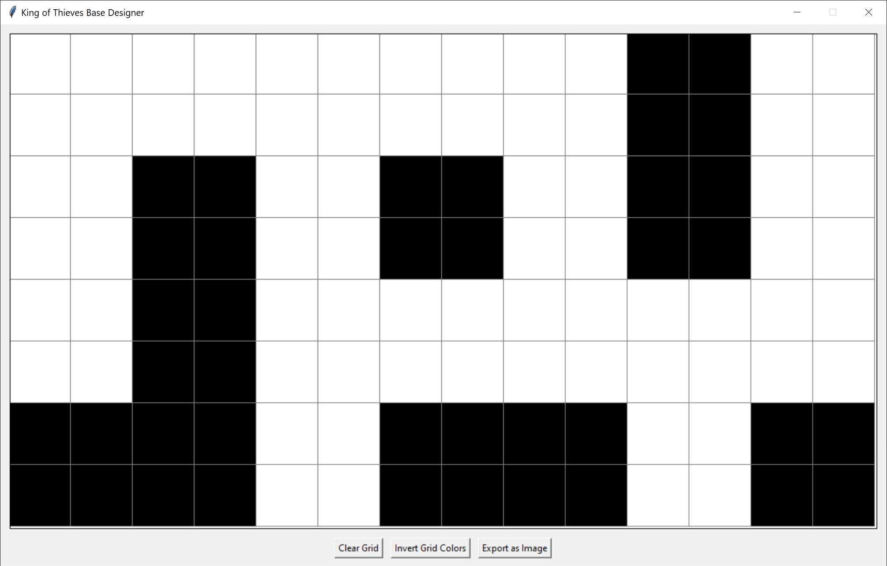
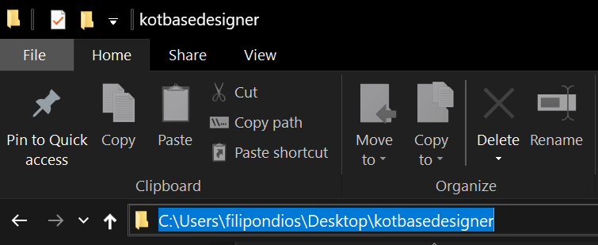

<div align="center">
  <h1>King of Thieves Base Designer</h1>
  <p>A simple desktop app to design bases for the game <a href="https://kingofthieves.com">King of thieves</a></p>
  
</div>

## Content Index

- [Download](#download)
- [Usage](#usage)
- [Build from Source](#build-from-source)
- [Running without Building](#running-without-building)
- [Contributing](#contributing)
- [License](#license)

## Download

You don't need to install the program on your computer. Simply download it and delete it whenever you want—no extra steps required. To download it, go to the [Releases](https://github.com/filipondios/kotbasedesigner/releases) section of this repository and in the latest version, download the `.exe` file.

When attempting to run the executable, a security warning may appear. You can bypass it if you trust me (:P). If you prefer a more secure option, I recommend following the steps described in the [Build from Source](#build-from-source) section. Otherwise, you're all set and can use the program freely.

> [!NOTE] 
> The executable may be larger than 10MB because it includes the Python interpreter and all necessary libraries packaged into a single file for portability, even though the UI itself is lightweight.

## Usage

The app is very straightforward. A grid is displayed in a window, and by clicking on the squares, you can design your desired base. Below the grid, you'll find three buttons: *Clear Grid*, *Invert Grid Colors*, and *Export to Image*.

- **Clear Grid**: Clears all black squares from the grid, turning them white.
- **Invert Grid Colors**: Converts black squares to white and vice versa.
- **Export to Image**: Exports the current design to a bordered `PNG` image.

## Build from Source

If you prefer not to use the pre-built executable from the [Releases](https://github.com/filipondios/kotbasedesigner/releases) section, you can build the `.exe` file yourself. You'll need [Python](https://www.python.org/downloads/) installed.

> [!IMPORTANT] 
> During Python installation, make sure to check the box that says **"Add Python to PATH"**.

Once Python is installed, go to the [Releases](https://github.com/filipondios/kotbasedesigner/releases) section of this repository and download the `.zip` source code file from the latest version. Extract the downloaded file and open the extracted folder. Then, in the file explorer, click on the folder path as shown in the image below and copy it.

<div align="center">

</div>

Next, search for the `PowerShell` application on Windows. Once opened, a terminal will appear. Inside the terminal, run the following command and press Enter:

```powershell
cd <previously-copied-path>
```

Finally, execute the following commands line by line:

```powershell
python -m venv env              # Create a virtual environment
.\env\Scripts\Activate.ps1      # Activate the environment
pip install -r requirements.txt # Install dependencies
```

Finalmente, genera el archivo `.exe` ejecutable:

```powershell
pyinstaller --onefile --windowed .\kotbasedesigner.py
```

Once completed, the executable file ``dist/kotbasedesigner.exe`` will be created inside the downloaded source folder. Now you can run the application with greater confidence :).

## Running without building

This option is for more experienced users, contributors, or those who prefer not to build the executable. The steps are the same as in the [Build from Source](#build-from-source) section, but without the final ``pyinstaller`` command. Instead, run:

```powershell
python kotbasedesigner.py
```

This command will launch the application without generating an executable file.

## Contributing

If you encounter any bugs, have suggestions for improvements, or would like to contribute to the project, you can:

- **Open an Issue**: Visit the [Issues](https://github.com/filipondios/kotbasedesigner/issues) tab to report problems or propose new features.
- **Submit a Pull Request**: Fork the repository, make your changes, and open a Pull Request for review.
- **Contact Me**: You can also reach out to me directly through my social media profiles (see the bottom of this page).

I welcome feedback and contributions to make this tool better for everyone!

## License

This project is under the [GPL-3.0 license](LICENSE)

---

Discord, Telegram: @Filipondios
